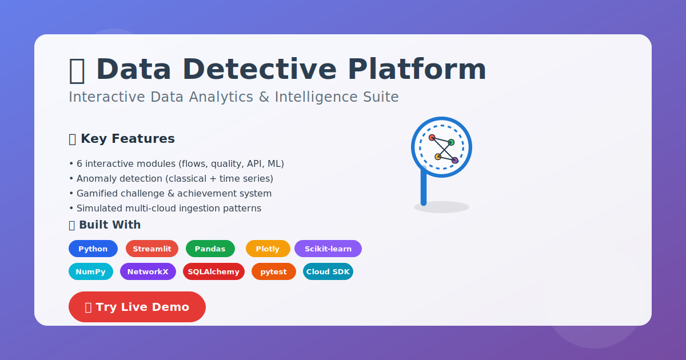

# Data Detective Platform

A comprehensive data analysis and debugging platform inspired by data analyst roles, showcasing expertise in Python, SQL, cloud tools, and data visualization.

## Features

- **Dashboard**: Central hub for all tools
- **Data Flow Mapper**: Visualize data flows and identify glitches
- **Sanity Checker**: Automated validation of data pipelines
- **API & Log Explorer**: Inspect API feeds and logs for anomalies
- **Anomaly Detection**: Machine learning-based anomaly detection
- **Challenge Mode**: Gamified data mystery solving
- **Cloud Integration**: Connect to GCP, AWS, Azure data sources

## Installation

1. Clone the repository
2. Create virtual environment: `python -m venv venv`
3. Activate: `.\venv\Scripts\activate` (Windows)
4. Install dependencies: `pip install -r requirements.txt`

## Usage

Run the app: `streamlit run app/dashboard.py`

## Project Structure

```
data-detective-platform/
├── app/                        # Main application code
├── static/                     # Static files
├── templates/                  # HTML templates
├── tests/                      # Unit tests
├── data/                       # Sample datasets
├── notebooks/                  # Jupyter notebooks
├── scripts/                    # Utility scripts
├── README.md
├── requirements.txt
└── .gitignore
```

## Technologies

- Python
- Streamlit
- Pandas, NumPy
- Plotly, NetworkX
- Scikit-learn
- SQLAlchemy
- Cloud SDKs (GCP, AWS, Azure)

## Visual Assets & Sharing

| Asset | Purpose |
|-------|---------|
| `thumbnail.svg` | Primary rich preview / presentation cover (accessible, light) |
| `thumbnail_dark.svg` | Dark mode / contrast-friendly variant |
| `thumbnail.min.svg` | Minimal fallback / fast-loading social card |

### Open Graph / Social Preview (GitHub Pages / Docs)
Add the following to an HTML `<head>` (for GitHub Pages or other site):

```html
<meta property="og:title" content="Data Detective Platform" />
<meta property="og:description" content="Interactive analytics suite: flows, quality checks, anomaly detection, API + logs, gamified challenges." />
<meta property="og:image" content="https://raw.githubusercontent.com/AbateG/data-detective-platform/main/thumbnail.png" />
<meta property="og:type" content="website" />
<meta name="twitter:card" content="summary_large_image" />
```

If you need a PNG, generate it via the helper script:

```bash
pip install cairosvg
python generate_assets.py
```

Exports will be placed in `assets/` (retina variants included when cairosvg is available).

### Quick Embed (Markdown)

```markdown

```

## Roadmap

- Real cloud warehouse connectivity (BigQuery / Postgres)
- CI pipeline & containerization
- Enhanced SQL lineage extraction
- User auth & multi-tenant state

## Attribution & AI Assistance

This project was human-directed with AI-assisted acceleration (code suggestions, refactor prompts, documentation scaffolding). All architectural decisions, validation logic, and testing were curated manually.

---
🚀 Live Demo: https://data-detective-platform.streamlit.app/
